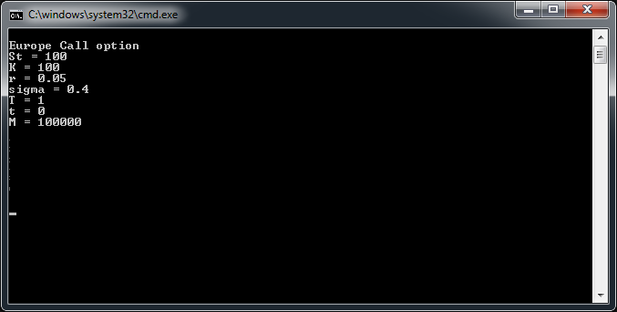
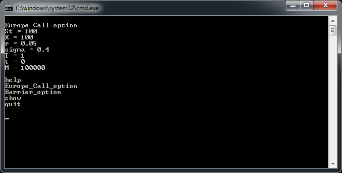

# App User Guide

This user guide is written for the users of the console interface of our program.

## Table of Contents
- [Features](#features)
- [Installation](#installation)
  - [Building the Project](#building-the-project)
  - [Importing the Package](#importing-the-package)
- [Usage](#usage)
  - [Main Principles](#main-principles)
  - [Working with the European call option](#working-with-the-european-call-option)
    - [Changing Parameters](#changing-parameters)
    - [Price](#price)
    - [Greeks](#greeks)
  - [Working with the Barrier Option](#working-with-the-barrier-option)
    - [Changing Parameters](#changing-parameters-1)
    - [Price](#price-1)
    - [Greeks](#greeks-1)
  - [Working with the Look-back Option](#working-with-the-look-back-option)
    - [Changing Parameters](#changing-parameters-2)
    - [Price](#price-2)
    - [Greeks](#greeks-2)
  - [Switching Random Generation](#switching-random-generation)
  - [Troubleshooting](#troubleshooting)
  - [Closing the Application](#closing-the-application)

## Features

* Compute the European call option, the barrier option and the look-back price
* Compute the European call option, the barrier option and the look-back option greeks:
  * delta
  * gamma
  * vega
* Provide statistical informations on the random variables.


## Installation

**This app only works on Windows NT systems.** We recommend using Windows 7 or any more recent Windows distribution.

Make sure you have the following files.
```
BarrierLookBackOptions.exe

```

## Usage

### Main Principles

To open the app, double-click on the `BarrierLookBackOptions.exe` file. A black window should appear.

You can type your instructions instructions directly in the window.



### Working with the European Call option

The European call option is the default product. However, if you have to switch back to this product, enter the following command.

```
Europe_Call_option
```


The parameters are displayed on start-up. Here are the equivalences in plain language.

| Abbreviation | Plain language | Description |
| --- | --- | --- |
| `St` | Initial stock value | The value of the stock at the initial time of the simulation. |
| `K` | Strike | The value above which the call will allow one to make profits. |
| `r` | Interest rate | The rate the bank will pay one for leaving money in the bank account. |
| `sigma` | Volatility | Volatility is one of the main measures for the simulation of the evolution of the stock price in the Black-Scholes model. It is usually givent in percentage. In this porgram, type `0.04` for 4%. |
| `T`| Final simulation time / Maturity | The time at which the simulation stop. It is also the time at which the owner of the option will choose either to take or reject the contract. |
| `t`| Initial simulation time | The time at which `St` is recorded. |
| `M`| Number of Monte-Carlo simulations | The number of iterations in the Monte-Carlo method. |

#### Changing parameters
To change the parameters, just type the abbreviation equated to the new value. If you want to change multiple parameters, you can simply type a coma between them.

Here is an example.

```
St=120,K=80
```

This command will simulatneously change `St`the initial stock value to `120` units and `K` the value of the strike to `80` units. The values must be separated by `,`. You should not type fractions. As an example type `0.3333` instead of 1/3.

You can change as many parameters as you want. You can display at any time the current parameters using the following command.

```
show
```

#### Price

In order to get the price, please type the following command.

```
price
```
Additional details such as the methods used, the error and the computation time are provided.

#### Greeks

You can ask for the following Greeks : delta, gamma, vega.

```
delta
```
```
gamma
```
```
vega
```

Additional details such as the methods used, the error and the computation time are provided.


### Working with the Barrier option

To use the barrier option, enter the following command.

```
Barrier_option
```

The parameters are displayed on start-up. Here are the equivalences in plain language.

| Abbreviation | Plain language | Description |
| --- | --- | --- |
| `St` | Initial stock value | The value of the stock at the initial time of the simulation. |
| `K` | Strike | The value above which the call will allow one to make profits. |
| `r` | Interest rate | The rate the bank will pay one for leaving money in the bank account. |
| `sigma` | Volatility | Volatility is one of the main measures for the simulation of the evolution of the stock price in the Black-Scholes model. It is usually givent in percentage. In this porgram, type `0.04` for 4%. |
| `T`| Final simulation time / Maturity | The time at which the simulation stop. It is also the time at which the owner of the option will choose either to take or reject the contract. |
| `t`| Initial simulation time | The time at which `St` is recorded. |
| `B`| Barrier | The value of the barrier. It will automatically be recognised as a down-and-out call option or an upper-and-out call option. |
| `M`| Number of Monte-Carlo simulations | The number of iterations in the Monte-Carlo method. |


#### Changing parameters
To change the parameters, just type the abbreviation equated to the new value. If you want to change multiple parameters, you can simply type a coma between them.

Here is an example.

```
St=120,K=80
```

This command will simulatneously change `St`the initial stock value to `120` units and `K` the value of the strike to `80` units.

You can change as many parameters as you want. You can display at any time the current parameters using the following command.

```
show
```

#### Price

In order to get the price, please type the following command.

```
price
```
Additional details such as the methods used, the error and the computation time are provided.

#### Greeks

You can ask for the following Greeks : delta, gamma, vega.

```
delta
```
```
gamma
```
```
vega
```

Additional details such as the methods used, the error and the computation time are provided.


### Working with the Look-back option

To use the look-back option, enter the following command.

```
Lookback_option
```

The parameters of the Look-back option displayed when switching to this product. Here are the equivalences in plain language.

| Abbreviation | Plain language | Description |
| --- | --- | --- |
| `St` | Initial stock value | The value of the stock at the initial time of the simulation. |
| `K` | Strike | The value above which the call will allow one to make profits. |
| `r` | Interest rate | The rate the bank will pay one for leaving money in the bank account. |
| `sigma` | Volatility | Volatility is one of the main measures for the simulation of the evolution of the stock price in the Black-Scholes model. It is usually givent in percentage. In this porgram, type `0.04` for 4%. |
| `T`| Final simulation time / Maturity | The time at which the simulation stop. It is also the time at which the owner of the option will choose either to take or reject the contract. |
| `t`| Initial simulation time | The time at which `St` is recorded. |
| `M`| Number of Monte-Carlo simulations | The number of iterations in the Monte-Carlo method. |


#### Changing parameters
To change the parameters, just type the abbreviation equated to the new value. If you want to change multiple parameters, you can simply type a coma between them.

Here is an example.

```
St=120,K=80
```

This command will simulatneously change `St`the initial stock value to `120` units and `K` the value of the strike to `80` units.

You can change as many parameters as you want. You can display at any time the current parameters using the following command.

```
show
```

#### Price

In order to get the price, please type the following command.

```
price
```
Additional details such as the methods used, the error and the computation time are provided.

#### Greeks

You can ask for the look-back option delta, gamma, vega.

```
delta
```
```
gamma
```
```
vega
```

Additional details such as the methods used, the error and the computation time are provided.


### Switching Random Generation

The generation method of the random variables is a key challenge, and the performance can vary depending on the computer used. The use has the oppotunity to choose between two (uniform) random number generation methods.

To select the linear congruential method, type the following command. This one is used by default.
```
linear_congruential
```
Some computers are more efficient using one of the system built-in functions, such as `mt19937`. To switch to this method, type the following command.
```
mt19937
```


### Troubleshooting

At any time, you can type the following command in the terminal. A list of the instructions available will appear.

```
help
```



You can display at any time the current parameters using the following command.

```
show
```

To switch between different products, please type directly the name of the product. As an example, to switch to the barrier option, simply type the following instruction.

```
Barrier_option
```

### Closing the application

You can either type the following command,
```
quit
```
or simply close the window.
